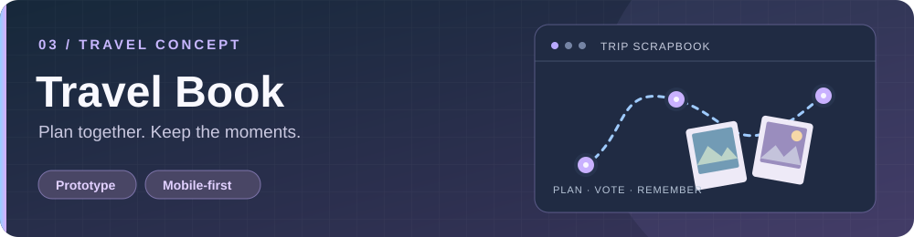

  

   

  **Hi, I'm Sutthiphong (`@safeJJ`).**  
  ผมทำเว็บแอปและเครื่องมือที่ช่วยให้งานจริงเป็นระบบและใช้งานง่ายขึ้น

  <a href="https://github.com/safeJJ?tab=repositories">Explore my projects</a>

---

### What I work on

- **Operations & inventory** — turning warehouse and stock workflows into usable software.
- **Full-stack web apps** — building interfaces, APIs, and data models together.
- **Small, useful experiments** — exploring ideas through focused prototypes.

### Selected projects

Warehouse management system covering inventory, receiving, QC, production, orders, and shipping. [View repository →](https://github.com/safeJJ/warehouse-pro)

Browser-based demo for products, pricing, stock levels, and low-stock summaries. [View repository →](https://github.com/safeJJ/shopmanagement)

Mobile-first concept for planning trips together and collecting travel memories. [View concept →](https://github.com/safeJJ/travel-book)

### Tools in my public work

  
  
  
  
  
  
  

เปิดให้ดูเฉพาะโปรเจกต์ที่เป็นสาธารณะ · More work is in progress.
